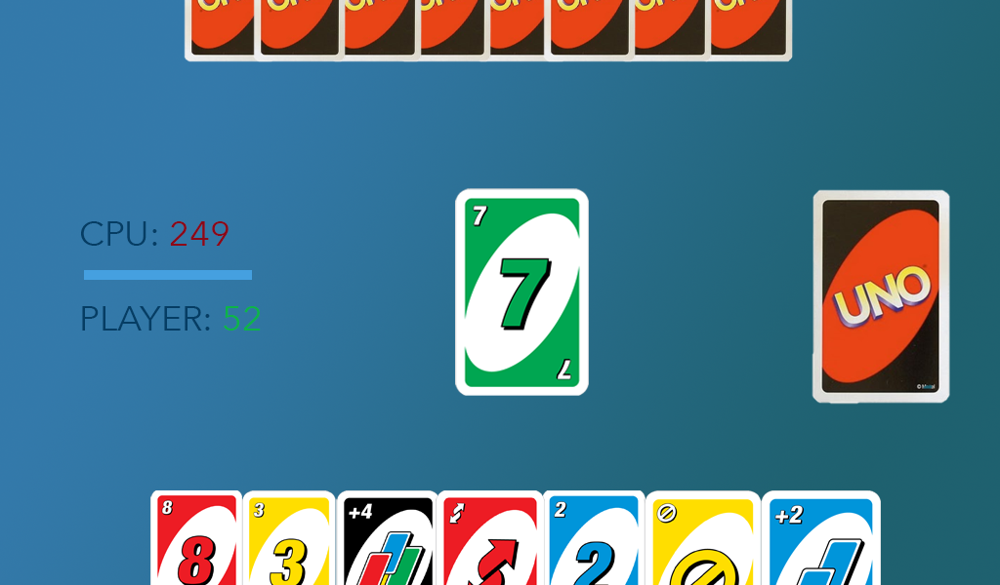

# Project1-Uno
SEI-629 Project 1 - HTML, CSS, JS

Seth Johnson

 

 

# Welcome to UNO!
 
<a href="https://sjaugmented.github.io/Project1-Uno/">Play it here.</a>

# User Story.

The game will start automatically upon loading.

The player and the CPU will each begin with 7 cards, and a number card will begin the Play Pile. The player will go first. The player can either click on a card of matching value or color to play it, play an Action Card (Reverse, Skip, Draw 2, Draw 4, Wild), or if no playable cards are available, click on the Draw Pile for a new card and forfeit their turn.

Next the CPU will play, either playing an appropriate card or taking one from the Draw Pile.

Draw 2 (+2) and Draw 4 (+4) cards will automatically add their amount to the victim's hand and advance the turn. Reverse and Skip cards will both skip the victim's turn (since there are only two players, Reverse essentially becomes a Skip). Wild cards may be played at any time.

The immediate goal is to be the first one to have no cards, at which time the opposing player's cards will be totaled and added to their score according to the following rules:

numbered cards 0-9 = face value
 
Reverse, Skip, +2 = 20pts
 
Wild, Wild +4 = 50pts

The first player to reach 100 loses the game.

## Cards will be deployed as objects.

Number Cards are straight forward:

red8 = {  
    value: 8, 
    point: 8, 
    color: 'red', 
    changeTurn: true, 
    drawValue: 0 
}

Action Cards will be assigned a value for the sake of logic comparisons, in ascending order of danger to the CPU in the event it loses:

greenReverse = { 
    value: 10, 
    point: 20, 
    color: 'green', 
    changeTurn: false, 
    drawValue: 0 
}

orangeSkip = { 
    value: 11, 
    point: 20, 
    color: 'yellow', 
    changeTurn: false, 
    drawValue: 0 
}

blueDraw2 = { 
    value: 12, 
    point: 20, 
    color: 'blue', 
    changeTurn: true, 
    drawValue: 2 
}

wild = { 
    value: 13, 
    point: 50, 
    color: 'any', 
    changeTurn: true, 
    drawValue: 0 
}

wild4 = { 
    value: 14, 
    point: 50, 
    color: 'any', 
    changeTurn: true, 
    drawValue: 4 
}

The gameController will use the changeTurn and drawValue properties to determine whose turn it is and whether or not any cards need to be drawn.

## CPU LOGIC
The CPU will have two arrays it keeps track of two arrays:

cpuHand = [] 
playableCards = []

Based on the last card played and it's properties, the CPU will loop through it's cpuHand array, and any card that matches either the value or color of the last card played will be pushed into the playableCards array along with any wilds the CPU may be holding.

Since part of the fun and strategy is knowing when to play your Action Cards, the CPU will randomize their strategy each turn, determined by a Math.Random() variable. If the randomizer is above 0.5, the CPU will prioritize playing Action Cards in an effort to keep their losing score low. If the randomizer is below 0.5, the CPU will hold onto their Action Cards for a later turn and instead play Number Cards. There will also be logic to skip the randomizer once the player gets below a certain number of cards, at which point the CPU will only prioritize Action Cards.

## PLAYER EXPERIENCE
Similar to how the computer will keep track of which cards it can play, so will the gameController do for the player. Should the player click an invalid card, a message will pop up telling the player so. 

These messages and the Game Over screen will be the only on screen prompts in an effort to minimize distractions and allow the flow of the game to take front and center.

(In an effort to protect against unintended clicks, there might be an "Are you sure?" message if the player clicks the Draw Pile while holding playable cards.)

The goal is to create an aesthetically pleasing, minimal-yet-satisfying game loop that is relaxing and entertaining and that - hopefully - users will want to play again and again.

## CHALLENGES & UNCONQUERED LANDS

Overall I'm very happy with Project 1. The biggest challenge was for the CPU to feel as human as possible, complete with delays for decision making and a varying strategy of when to play what cards. The CPU even has a "vengeance factor," remembering if and when the player hit it with a draw card, and responding in kind if it has draw cards of its own.

Also very happy with the admittedly basic CSS styling and animations I was able to achieve and how it's optimized (kind of) for mobile.

I wish I'd had more time to refactor and pair down my code. I did the best I could, but I built a bit of a labryrinth. Because of the different ways the CPU and player logic were structured and how hands are kept track of and linked to the DOM, it was a little difficult to create functions that worked for both players. I did the best I could to follow the DRY principle, but at just over 900 lines of code, I could have done better.

The only issue left that's bugging (pun intended) me is that every once and a while, after the user plays a wild card and picks a new color, the CPU has a tendency to play multiple cards all at once. It's not cheating - when you check the console logs, it's usually playing a skip or reverse card, followed by a number card, but it all happens at once and looks like the CPU is laying down 2-3 cards in one turn. I suspect this is an issue with how I've structured the setTimeouts, but I can't pin down exactly where in the code the bug is being generated.

## TECHNOLOGIES

HTML

CSS

JavaScript